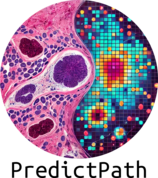

# Introducción{background-color="black"}

<!--

## Plan general{.smaller}

| Tiempo | Actividad | Detalles |
|:--:|:-----------|:----------------------|
| 5 min  | **Bienvenida y breve contexto** | ¿Qué es Quarto? ¿Para qué sirve? (Presentaciones, reportes, sitios, papers científicos) |
| 5 min  | **Instalación (o verificación)** | Confirmar que todos tengan instalado: R/RStudio o VS Code + Quarto CLI |
| 10 min | **Primera actividad práctica: Mi primer documento** | Crear un `.qmd`, escribir título, texto, código en R o Python, y renderizar a HTML |
| 10 min | **Actividad práctica 2: Mi primera presentación** | Cambiar `format: revealjs`, agregar 2-3 slides |
| 5 min  | **Mostrar brevemente: crear un sitio web** | Enseñar cómo se arma un pequeño sitio básico (`quarto create-project`) |
| 5 min  | **Personalización básica** | Agregar tema, cambiar diseño en YAML, mostrar extensión de bibliotecas |
| 5 min  | **Cierre y preguntas** | Dudas rápidas + compartir recursos para seguir aprendiendo |

Total: 45 minutos

::: notes
- Agregar posibilidad de usar referencias
:::

-->

## ¿Qué es Quarto?{background-image="images/institutional/background.png"}

Se trata de un *sistema de publicación científica* de código abierto que permite:

:::: {.columns}

::: {.column width="40%"}


:::

::: {.column width="50%"}
- Crear documentos
- Sitios web
- Presentaciones
- Libros
- PDFs
- Entre otros

:::
::::


::: notes
Leer esta diapositiva tal como viene. Esta presentación usa el formato revealjs
:::

## ¿Qué es Quarto?{background-image="images/institutional/background.png"}

El tipo de producto que se genera con Quarto depende del formato que se use y la finalidad. Por ejemplo, para presentaciones se podria utilizar: html (a través de revealjs), powerpoint, o latex/pdf (a través de la clase beamer).

:::: {.columns}

::: {.column width="40%"}
::: {.callout-important}
## Importante:
Esta presentación utiliza revealjs!
:::
:::

::: {.column width="60%"}


:::
::::


::: notes
Con revealjs se pueden crear presentaciones basadas en HTML
:::

## ¿Qué es Quarto? {background-image="images/institutional/background.png"}

::: content-wrapper
Ejemplos de los demás formatos son:

+------------------------------+----------------------------------+----------------------------------+-------------------------------+
| Documentos                   | Websites                         | Notebooks Interactivos           | EPUB                          |
+==============================+==================================+==================================+===============================+
|  |  |  |  |
+------------------------------+----------------------------------+----------------------------------+-------------------------------+
:::


::: notes
Observar los ejemplos
:::

## ¿Cómo funciona Quarto?{.smaller}

::: {.fragment}
Al renderizar un archivo ´.qmd´ con Quarto, los bloques de código son procesados por Jupyter, y la combinación resultante de código, markdown y gráficas de salida son convertidas a markdown. Posteriormente se utiliza Pandoc para crear un documento en el formato deseado.
:::

:::{.fragment .fade-up}

:::

:::{.fragment}
::: {.callout-note}
A través de jupyter se puede realizar ejecución de python, R, julia y otros lenguajes de programación
:::
:::

# Opciones de personalización {background-color="black"}

## Personalización

::: content-wrapper
[Con el uso de *enlaces web*, podemos cambiar la imagen de background con facilidad.]{style="color: white;"}

[ Es también ]{style="color: cyan;"}[posible usar]{style="color:#74e964; font-size:150%;"} <b>tags HTML</b> para <i>personalizar</i> los textos.</p>

<p>[Podemos también incluir imágenes en cualquier tamaño desde la web!]{style="color: white;"}</p>

<p></p>
:::

::: notes
Con QUATRO podemos cambiar fácilmente las imágenes de background por medio de un enlace web
:::

## [Imágenes animadas]{style="color:#FF5733;"} {background-image="https://marketplace.canva.com/EAFZcmTpKas/1/0/1600w/canva-video-intro-portada-fondo-background-simple-rosa-dorado-U93tpA4NMDA.jpg"}

::: content-wrapper2
[Podemos utilizar imágenes en formato GIF:]{style="color: black;"}

<p></p>
:::

::: notes
Podemos incluir varios formatos de imagen
:::

# Incluyendo contenido {background-color="black"}

## Ecuaciones

Es posible utilizar la misma notación de LaTex para incluir ecuaciones en nuestros documentos:

$$\mathbb{E}[x] = \int x \cdot p(x) dx$$

## Tablas {.smaller}

Es también fácil crear tablas con distintos estilos:

::: {.panel-tabset}

### Código

```{verbatim}
+----------+-----------+--------+-------+
| Producto | Categoría | Precio | Stock |
+==========+===========+========+=======+
| Manzana  | Fruta     | \$1.25 | 120   |
+----------+-----------+--------+-------+
| Leche    | Alimentos | \$2.50 | 80    |
+----------+-----------+--------+-------+
| Cereal   | Desayuno  | \$3.00 | 50    |
+----------+-----------+--------+-------+
| Pan      | Alimentos | \$1.75 | 200   |
+----------+-----------+--------+-------+
| Tomates  | Verdura   | \$2.00 | 150   |
+----------+-----------+--------+-------+
: Demonstration of pipe table syntax
```


### Renderizado por defecto

+----------+-----------+--------+-------+
| Producto | Categoría | Precio | Stock |
+==========+===========+========+=======+
| Manzana  | Fruta     | \$1.25 | 120   |
+----------+-----------+--------+-------+
| Leche    | Alimentos | \$2.50 | 80    |
+----------+-----------+--------+-------+
| Cereal   | Desayuno  | \$3.00 | 50    |
+----------+-----------+--------+-------+
| Pan      | Alimentos | \$1.75 | 200   |
+----------+-----------+--------+-------+
| Tomates  | Verdura   | \$2.00 | 150   |
+----------+-----------+--------+-------+
: Demonstration of pipe table syntax

### Otros renderizados

```{css}
.table-striped {
  > thead > tr > * {
    background-color: cyan;
  }
  
  > tbody > tr:nth-of-type(odd) > * {
    background-color: #f2f2f2;
  }
  
  // Estilo para el caption
  > caption {
    caption-side: bottom; /* Posiciona el caption debajo de la tabla */
    font-size: 0.6em;
  }
}
```

+----------+-----------+--------+-------+
| Producto | Categoría | Precio | Stock |
+==========+===========+========+=======+
| Manzana  | Fruta     | \$1.25 | 120   |
+----------+-----------+--------+-------+
| Leche    | Alimentos | \$2.50 | 80    |
+----------+-----------+--------+-------+
| Cereal   | Desayuno  | \$3.00 | 50    |
+----------+-----------+--------+-------+
| Pan      | Alimentos | \$1.75 | 200   |
+----------+-----------+--------+-------+
| Tomates  | Verdura   | \$2.00 | 150   |
+----------+-----------+--------+-------+
: Demonstration of pipe table syntax {.striped}

:::


::: notes
Podemos incluir tablas
:::

# ¿Puedo usar Código - en R? {background-color="black"}

## Generando una lista {background-image="images/institutional/background.png"}

::: content-wrapper
Podemos hacer uso de bloques de código con R. Observemos una lista:

```{verbatim}
# List of values
lista <- list(23, 45, 56, 78, 45, 23, 56, 67, 89, 45, 56, 67, 34, 23, 45, 23, 23, 23, 23, 78, 78, 78, 56, 56, 56, 56, 23, 34, 45, 89, 89, 89, 57, 56, 34, 34)

# Convert list to a numeric vector and transpose it to display horizontally
lista_numeric <- unlist(lista)

# Print the table horizontally without column names
print(lista)
```

```{r}
# List of values
lista <- list(23, 45, 56, 78, 45, 23, 56, 67, 89, 45, 56, 67, 34, 23, 45, 23, 23, 23, 23, 78, 78, 78, 56, 56, 56, 56, 23, 34, 45, 89, 89, 89, 57, 56, 34, 34)

# Convert list to a numeric vector and transpose it to display horizontally
lista_numeric <- unlist(lista)

# Create a data frame with one row, and remove column names
lista_df_horizontal <- data.frame(t(lista_numeric))

# Remove the column names to only show the values
colnames(lista_df_horizontal) <- NULL

# Print the table horizontally without column names
print(lista_df_horizontal)
```
:::

::: notes
Podemos crear listas
:::

## Histograma {background-image="images/institutional/background.png"}

Grafiquemos algunos datos

:::: {.columns}

::: {.column width="60%"}

¿Cómo es la frecuencia de los datos?

```{verbatim}
# List of values
hist(lista_numeric, main="Histograma de la Lista", 
xlab="Valores", col="lightblue", border="black")
```
:::

::: {.column width="40%"}
```{r}
# List of values
hist(lista_numeric, main="Histograma de la Lista", xlab="Valores", col="lightblue", border="black")
```

:::

::::


## Boxplot {background-image="images/institutional/background.png"}

Grafiquemos algunos datos

:::: {.columns}

::: {.column width="60%"}

Visualicemos la distribución y el rango intercuartilico de los datos

```{verbatim}
# List of values
boxplot(lista_numeric, main="Boxplot de la Lista", 
ylab="Valores", col="lightgreen", border="black")
```
:::

::: {.column width="40%"}
```{r}
# List of values
boxplot(lista_numeric, main="Boxplot de la Lista", ylab="Valores", col="lightgreen", border="black")
```
:::
::::


## Estimación de la densidad {background-image="images/institutional/background.png"}

Grafiquemos algunos datos

:::: {.columns}

::: {.column width="60%"}

Estimemos la densidad de los datos

```{verbatim}
plot(density(lista_numeric), main="Gráfico de Densidad de la Lista", 
xlab="Valores", ylab="Densidad", col="darkblue", lwd=2)
```

:::

::: {.column width="40%"}
```{r}
plot(density(lista_numeric), main="Gráfico de Densidad de la Lista", xlab="Valores", ylab="Densidad", col="darkblue", lwd=2)
```
:::

::::


::: notes
Podemos crear listas y generar gráficas con ellas
:::

## Distribución acumulada {background-image="images/institutional/background.png"}

Grafiquemos algunos datos

:::: {.columns}

::: {.column width="60%"}
¿Cómo sería la distribución acumulada de los datos?

```{verbatim}
ecdf_plot <- ecdf(lista_numeric)
plot(ecdf_plot, main="Función de Distribución Acumulada de la Lista", 
xlab="Valores", ylab="Probabilidad acumulada", col="darkgreen", lwd=2)
```

:::

::: {.column width="40%"}
```{r}
ecdf_plot <- ecdf(lista_numeric)
plot(ecdf_plot, main="Función de Distribución Acumulada de la Lista", xlab="Valores", ylab="Probabilidad acumulada", col="darkgreen", lwd=2)
```
:::
::::

::: notes
Podemos crear listas y generar gráficas con ellas
:::

## Modelos lineales {.smaller background-image="images/institutional/background.png" auto-animate="true"}

Los modelos lineales pueden variar demasiado si la muestra contiene pocos datos.

```{r}
set.seed(30042025)
n_total <- 100
x <- seq(0, 10, length.out = n_total)
y <- 3 * x + rnorm(n_total, mean = 0, sd = 5)
datos <- data.frame(x = x, y = y)

library(ggplot2)
```

```{r echo = TRUE}
n <- 10
datos_sub <- datos[1:n, ]
modelo <- lm(y ~ x, data = datos_sub)

ggplot(datos_sub, aes(x = x, y = y)) +
  geom_point(alpha = 0.7) +
  geom_smooth(method = "lm", se = FALSE, color = "red") +
  labs(
    title = paste("Tamaño de muestra:", n),
    subtitle = paste("Pendiente estimada:", round(coef(modelo)[2], 2))
  ) +
  theme_minimal()
```

## Modelos lineales {.smaller background-image="images/institutional/background.png" auto-animate="true"}

Los modelos lineales pueden variar demasiado si la muestra contiene pocos datos.

```{r}
set.seed(30042025)
n_total <- 100
x <- seq(0, 10, length.out = n_total)
y <- 3 * x + rnorm(n_total, mean = 0, sd = 5)
datos <- data.frame(x = x, y = y)

library(ggplot2)
```

```{r echo = TRUE}
n <- 30
datos_sub <- datos[1:n, ]
modelo <- lm(y ~ x, data = datos_sub)

ggplot(datos_sub, aes(x = x, y = y)) +
  geom_point(alpha = 0.7) +
  geom_smooth(method = "lm", se = FALSE, color = "red") +
  labs(
    title = paste("Tamaño de muestra:", n),
    subtitle = paste("Pendiente estimada:", round(coef(modelo)[2], 2))
  ) +
  theme_minimal()
```

## Modelos lineales {.smaller background-image="images/institutional/background.png" auto-animate="true"}

Los modelos lineales pueden variar demasiado si la muestra contiene pocos datos.

```{r}
set.seed(30042025)
n_total <- 100
x <- seq(0, 10, length.out = n_total)
y <- 3 * x + rnorm(n_total, mean = 0, sd = 5)
datos <- data.frame(x = x, y = y)

library(ggplot2)
```

```{r echo = TRUE}
n <- 100
datos_sub <- datos[1:n, ]
modelo <- lm(y ~ x, data = datos_sub)

ggplot(datos_sub, aes(x = x, y = y)) +
  geom_point(alpha = 0.7) +
  geom_smooth(method = "lm", se = FALSE, color = "red") +
  labs(
    title = paste("Tamaño de muestra:", n),
    subtitle = paste("Pendiente estimada:", round(coef(modelo)[2], 2))
  ) +
  theme_minimal()
```

# Conclusiones {background-color="black"}

## Para recordar {background-image="images/institutional/background.png"}
- Quarto es una solución de código abierto 
- Quarto facilita la escritura de documentos científicos
- Quarto permite realizar documentación de tareas relacionadas con la ciencia de datos.


## Semillero {background-image="images/institutional/background.png"}



[https://predict-path-uis.netlify.app/](https://predict-path-uis.netlify.app/)


# Gracias {background-color="black"}
